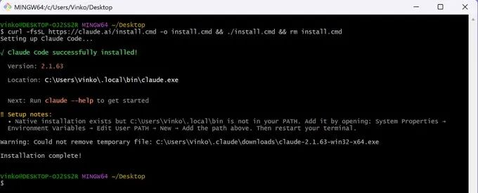
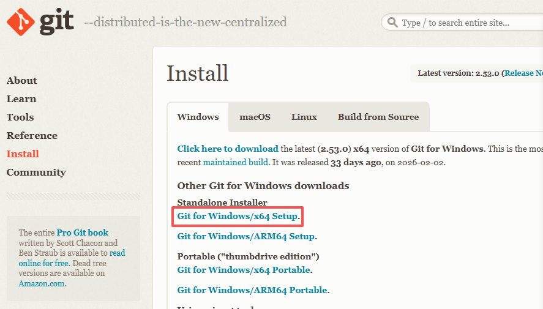
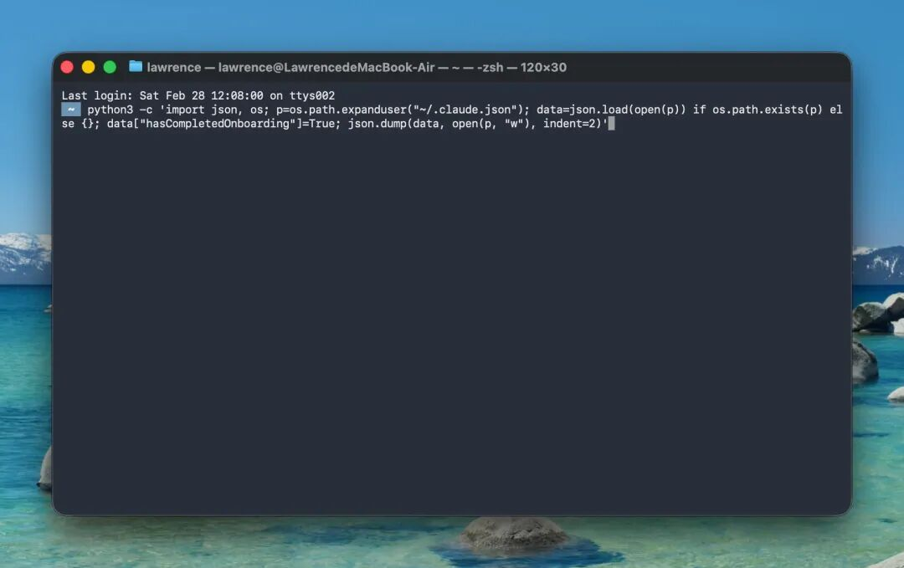
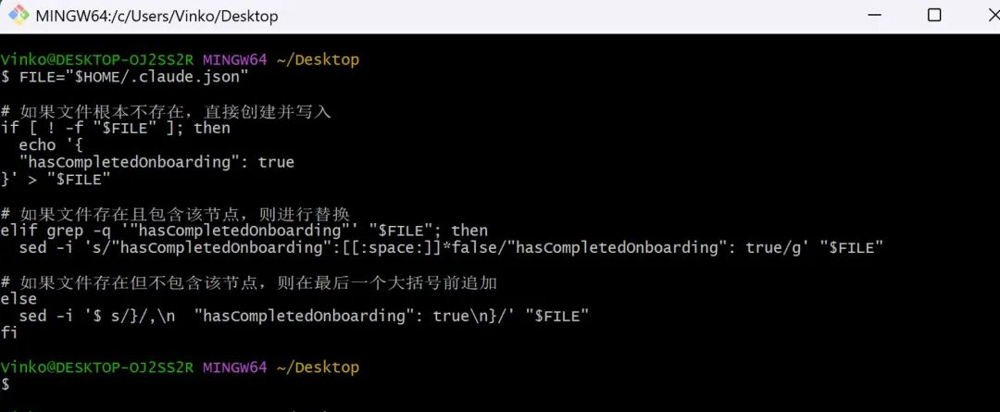
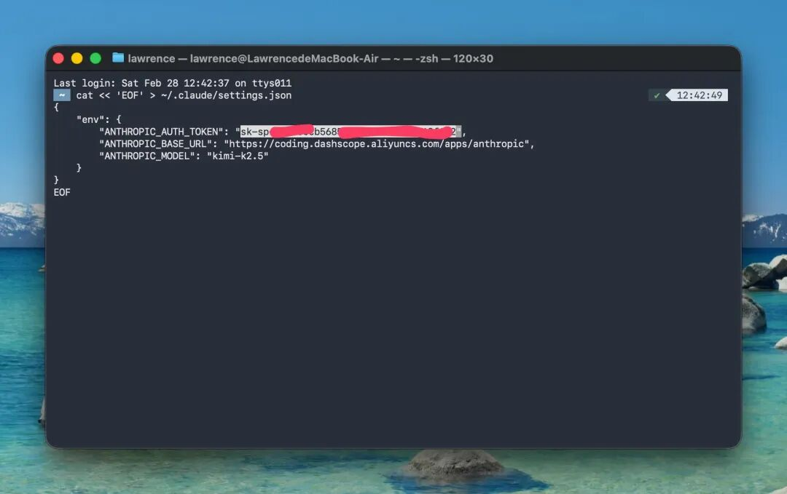
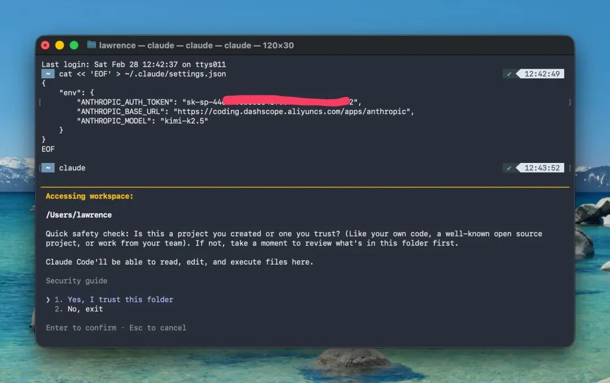
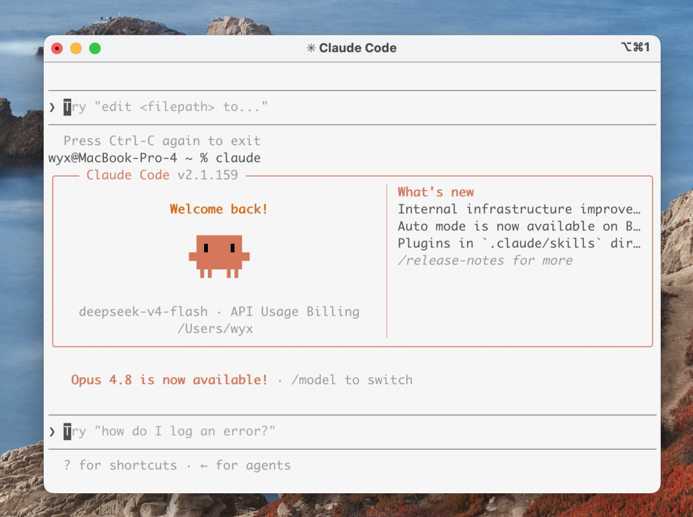
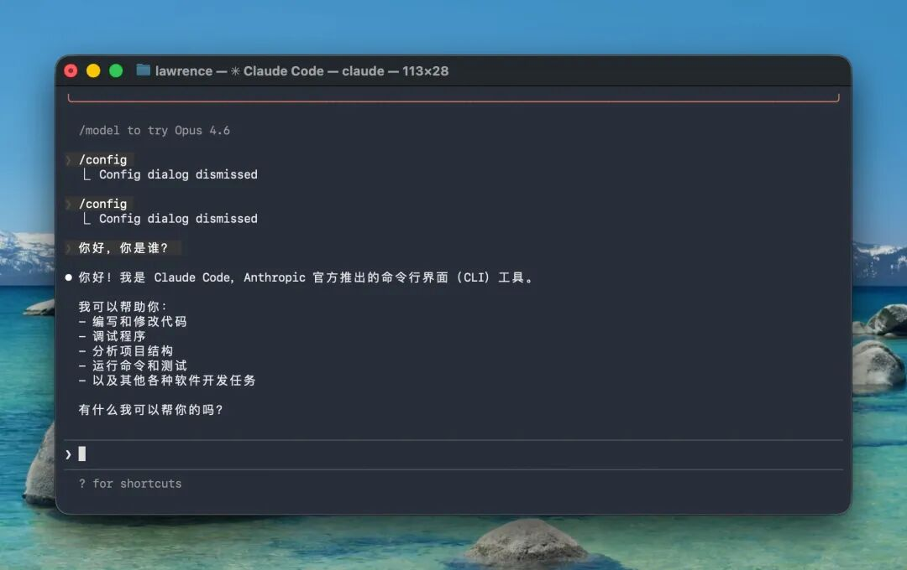

---

title: "Claude Code入门"
description: "Claude Code 极简安装与配置指南：带你快速入门原生 CLI Agent，教你如何跳过强制登录并配置第三方 API Key（如 DeepSeek 等），开启自主编程新体验。"
pubDate: 2026-06-01
updatedDate: 2026-06-01
heroImage: ""
tags: ["Claude Code"]
---

# Claude Code入门

最近和小组里面同学交流AI编程，发现大家还在卷 Cursor 甚至 Copilot，竟然没人碰 Claude Code，这确实有点可惜。

虽然Anthropic有很多被吐槽的地方，但Claude Code确实牛逼，走在时代前面，从工具链的进化路径来看，逻辑非常清晰：插件式（Copilot）-> 套壳 IDE（Cursor）-> 原生 CLI Agent（Claude Code）。

如果说前两者还是在“对话框里写代码”，那么 Claude Code 则标志着我们进入了“自主编程”阶段，**它不再是一个侧边栏插件，而是一个拥有 Shell 执行权的 Agent。**

它的两个核心优势，谁用谁知道：

- 全文件系统权限： 它不再复读代码，而是直接上手改文件。无论是执行 git提交、运行 npm run dev还是跑 pytest，它都在你的本地终端里闭环完成。

- 确定性的反馈机制： 以往最烦的是 AI 写完代码还要我手动复制、手动运行、发现报错再喂回给它。Claude Code 的逻辑是Plan -> Execute -> Test -> Refine 。

如果你有兴趣，可以跟着我的新手教程上手：

## 1. 安装 Claude Code

下面是官网推荐的安装方式：Mac Terminal、Git Bash（Windows）都有操作步骤，直接复制使用，不用理解原理。

### 安装步骤

**macOS**

```bash
curl -fsSL https://claude.ai/install.sh | bash
```

复制上面的命令，粘贴到 Terminal。这个时候会像“卡住”一样是正常的，表示开始下载软件，等一会就好。

**Windows**

```powershell
curl -fsSL https://claude.ai/install.cmd -o install.cmd && ./install.cmd && rm install.cmd
```
复制上面的命令，依次粘贴到 Git Bash 回车。这个时候像“卡住”一样是正常的，表示开始下载软件，等一会就好。



### 设置环境变量

```powershell
powershell -Command "[Environment]::SetEnvironmentVariable('Path', [Environment]::GetEnvironmentVariable('Path', 'User') + ';C:\Users\vinko\.local\bin', 'User')"
```

复制上面的命令粘贴到 Git Bash，然后重启 Git Bash。

如果 Windows 没有 Git Bash，这是安装地址，下一步下一步就行。 

https://git-scm.com/install/windows



## 2. 两句命令完成配置

敲重点：完成第二步之后，记得重启 Terminal、Git Bash。

### 第一句：跳过 Claude Code 的强制登录引导

**macOS**

```bash
python3 -c 'import json, os; p=os.path.expanduser("~/.claude.json"); data=json.load(open(p)) if os.path.exists(p) else {}; data["hasCompletedOnboarding"]=True; json.dump(data, open(p, "w"), indent=2)'
```

复制上面的命令，粘贴到 Terminal 回车。



**Windows**

```powershell
FILE="$HOME/.claude.json"
# 如果文件根本不存在，直接创建并写入
if [ ! -f "$FILE" ]; then
  echo '{
  "hasCompletedOnboarding": true
}' > "$FILE"
# 如果文件存在且包含该节点，则进行替换
elif grep -q '"hasCompletedOnboarding"' "$FILE"; then
  sed -i 's/"hasCompletedOnboarding":[[:space:]]*false/"hasCompletedOnboarding": true/g' "$FILE"
# 如果文件存在但不包含该节点，则在最后一个大括号前追加
else
  sed -i '$ s/}/,\n  "hasCompletedOnboarding": true\n}/' "$FILE"
fi
```

复制上面的命令，粘贴到 Git Bash 回车。



### 第二句：配置 API Key

Mac Terminal、Git Bash（Windows）命令一样。

```bash
cat << 'EOF' > ~/.claude/settings.json
{
    "env": {
        "ANTHROPIC_AUTH_TOKEN": "YOUR_API_KEY",
        "ANTHROPIC_BASE_URL": "https://api.deepseek.com/anthropic",
        "ANTHROPIC_MODEL": "deepseek-v4-pro[1m]"
    }
}
EOF
```

比如，我的模型选择 deepseek-v4-pro[1m]，再加上我的 API Key，我替换后粘贴进 Mac Terminal、Git Bash（Windows）回车。

MacOS 复制上面的命令，粘贴到 Terminal 回车。



Windows 复制上面的命令，粘贴到 Git Bash 回车

## 3. 打开并测试运行

打开 Claude Code，跑一次最小任务测试（截图发布时插入）。

下面的操作 Mac Terminal 与 Windows Git Bash 无区别

输入 claude 命令，打开 Claude Code：

```bash
claude
```

选择：Yes, I trust this folder，回车。



回车之后会直接进入到下图界面（不会提示登录）。



测试对话：



恭喜你成功安装 Claude Code。

别看它只是一个小小的 Terminal 对话框，里面其实藏着非常强的 Agent 能力。你可以先让它帮你改一个小项目、修一个报错，或者解释一段你看不懂的代码。

不过，到这里你应该也能感受到一个问题：

Claude Code 很强，但配置过程并不算优雅。
API Key、Base URL、模型名、不同供应商、不同项目环境，全都要自己手动改配置文件。

如果你只用一个模型，这还好。
但如果你想在 Claude、DeepSeek、Kimi、GLM、Gemini 之间来回切换，手动改配置就会变得非常痛苦。

所以，下一篇我会写一个更适合长期使用的工具：CC Switch。

它可以把 Claude Code 的模型源、API Key、Base URL、MCP、Prompt 等配置做成可视化管理，让你不用每次都手动改 settings.json。